## Mybrary

This full stack web course from [Web Dev Simplified](https://www.youtube.com/channel/UCFbNIlppjAuEX4znoulh0Cw) was another great tutorial! For the most part it was a review, however I learned a lot of CSS. I especially liked the use of one variable to change the hue used in the app. It allowed everything to change color with just the change of one number. The tutorial is [Full Stack Web Course](https://www.youtube.com/watch?v=qj2oDkvc4dQ&list=PLZlA0Gpn_vH9xx-RRVNG187ETT2ekWFsq&index=32&t=0s) and I would recommend it to anybody. Other than rearranging the file structure, none of the below is my own code, I just followed along with the tutorial.

Here is the main entrance to the app:
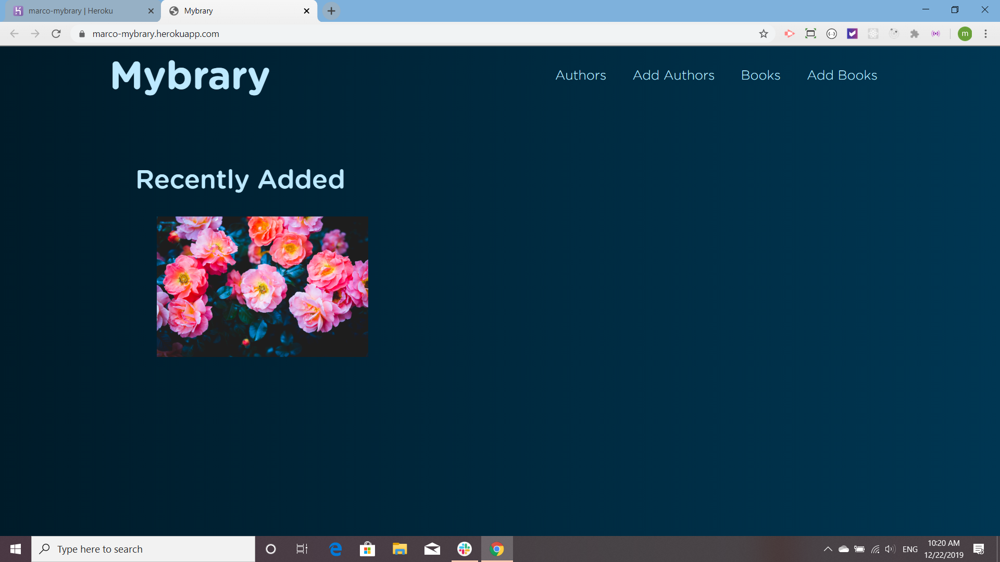
This page displays the authors and allows the user to search for an author.
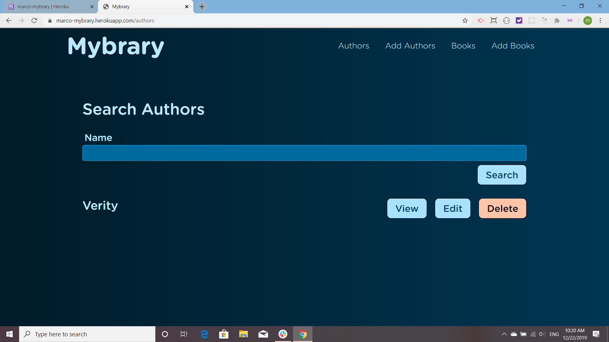
Here is the books page. The flower picture is supposed to be a book cover.
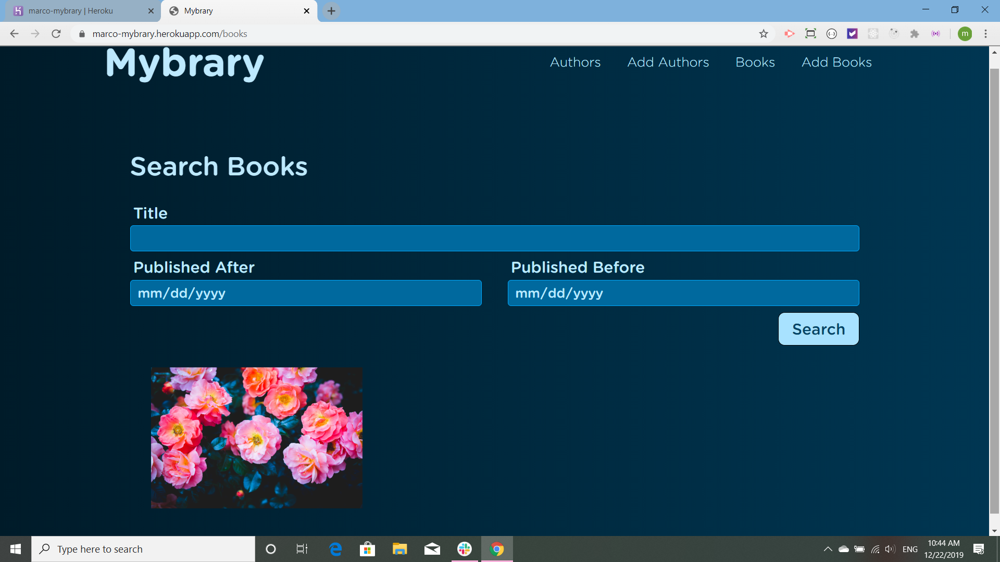
Here one can add a book, the  library used  for the uploading and storing of the images is called [filepond](https://pqina.nl/filepond/):
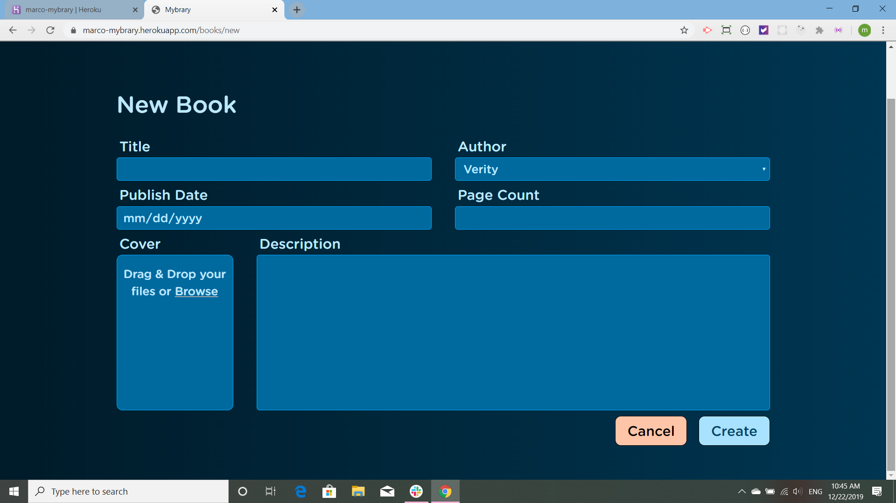
This page displays the Author and his or her works:
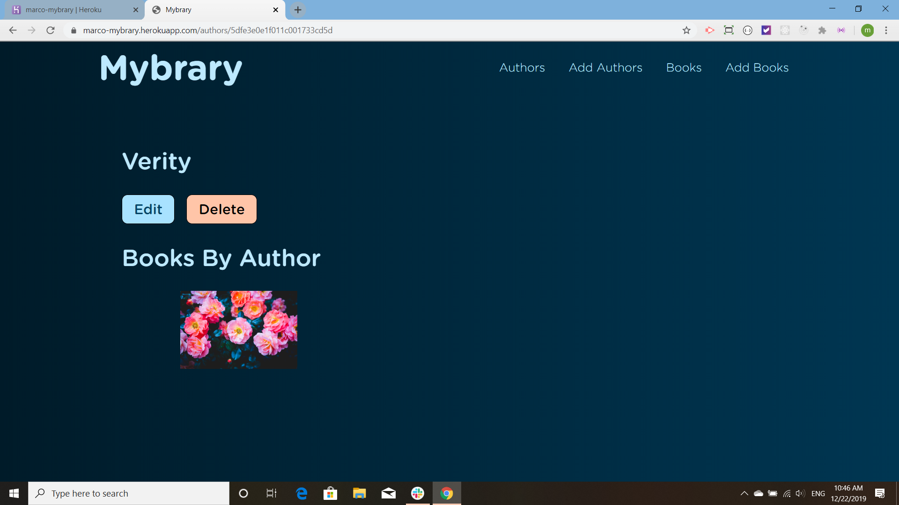
One comes to this edit Author form when one presses the edit button:
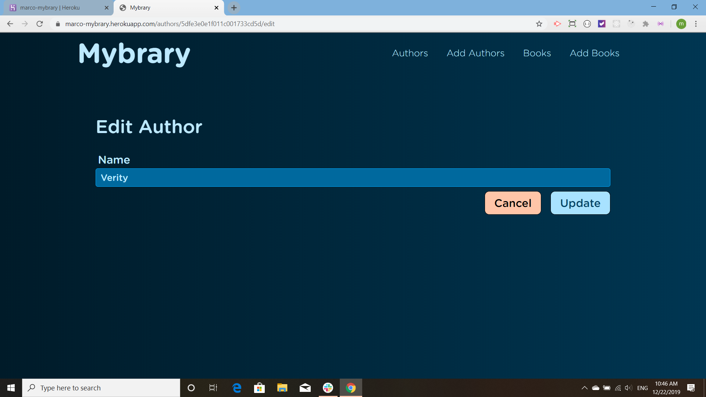
The user arrives at the display book page by clicking on the book or by pressing 'view':
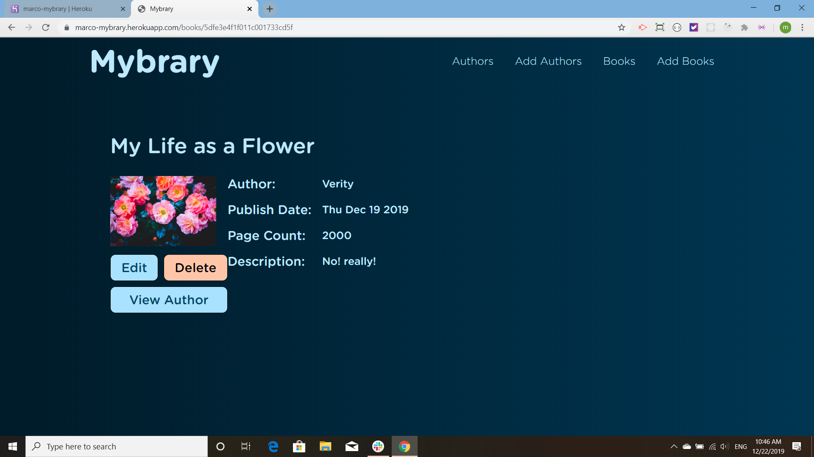
Here one can edit the books information:
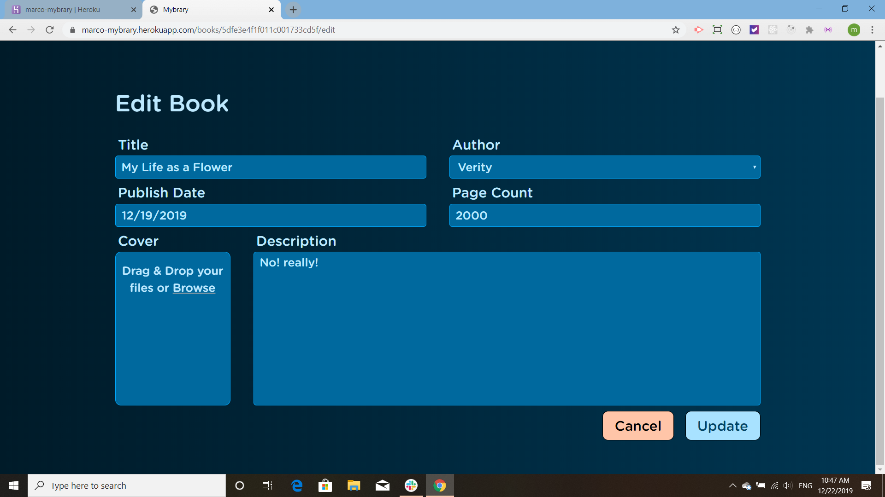
This is the part that I thought was really cool, by just changing one variable, one can change the color family used in the whole app.
This hue is 000:
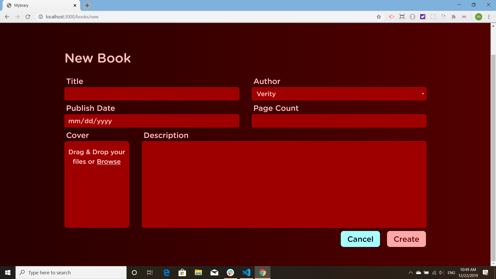
Here is the code for that change:
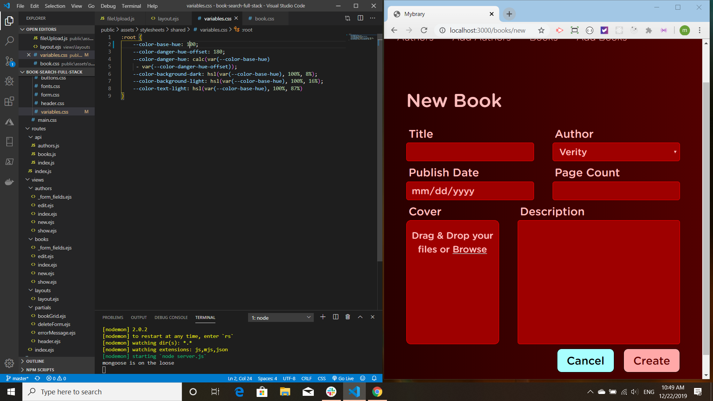
Here is 100:
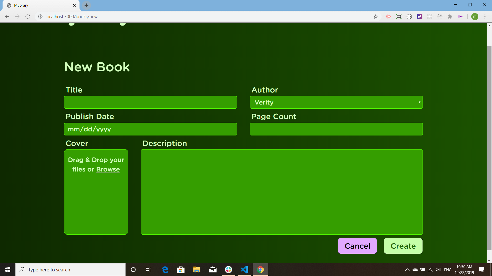
Here is 300:
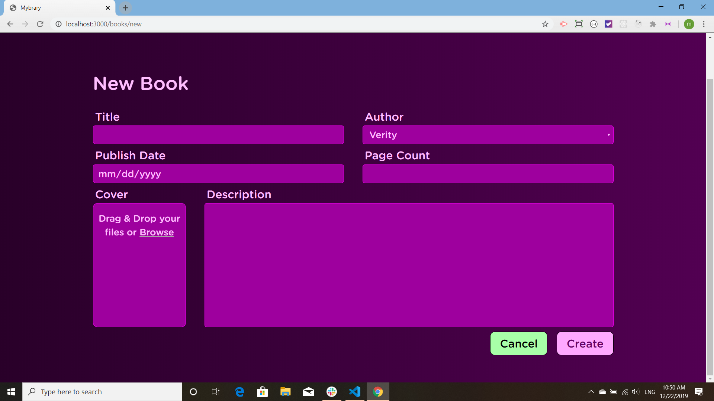
Finally here is 400:
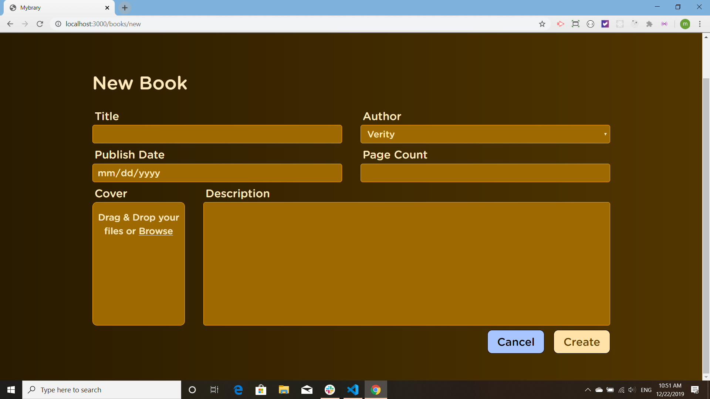
The preceeding screenshots were from the deployed app on Heroku. Here I had switched off to live editor to take a shot of the color changes. I am adding a book, but notice that the flower book is nowhere to be found as it is on the database of the Heroku site. Also notice that on the pulldown menu the innactive choices are in black while the active ones are a bright blue color:
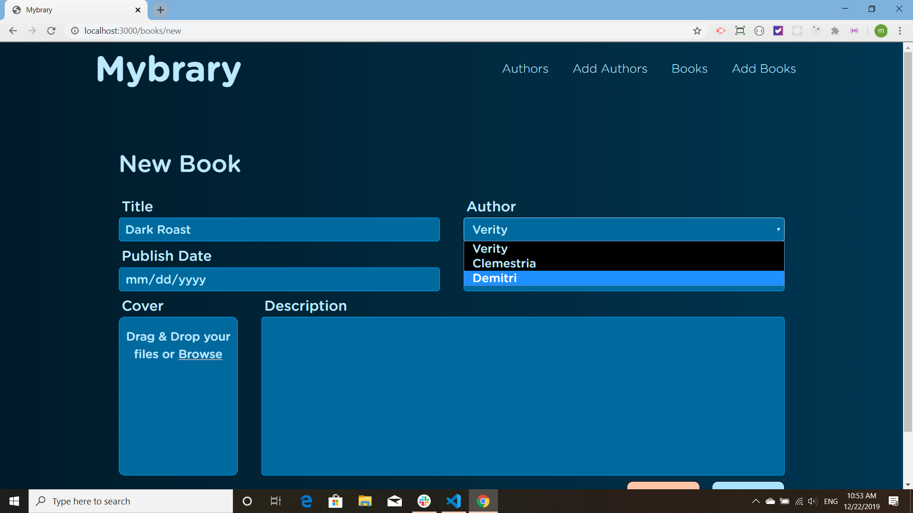
Here I am adding the cover using filepond:
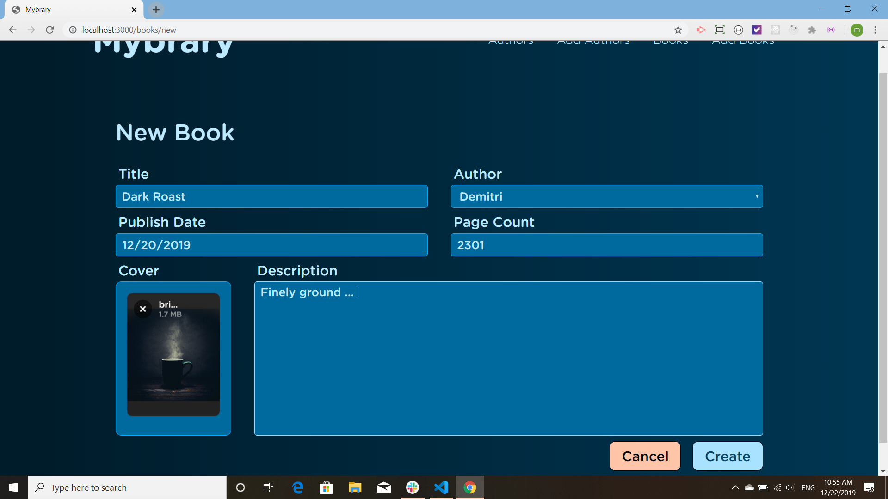
The book has been added and here is its information:

In this shot I go back and edit, adding 'perfect in the morning':
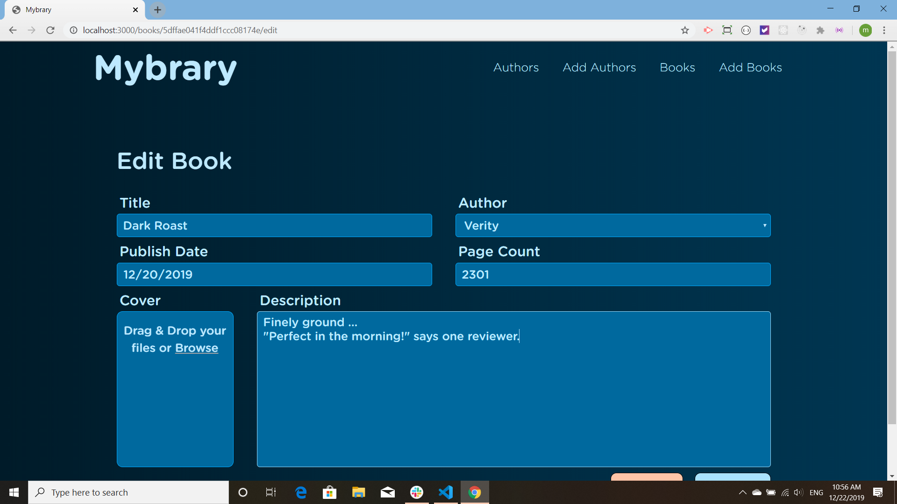
Edit was a success!:
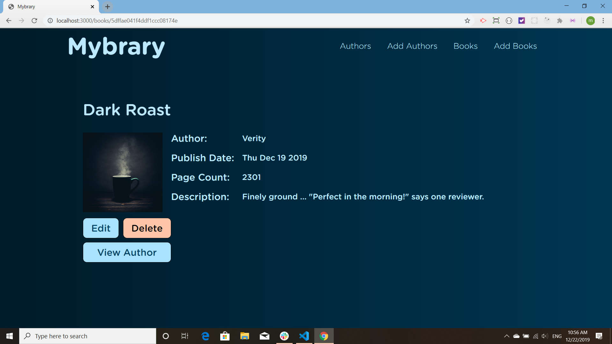
And here are the books -- on live server, not Heroku.
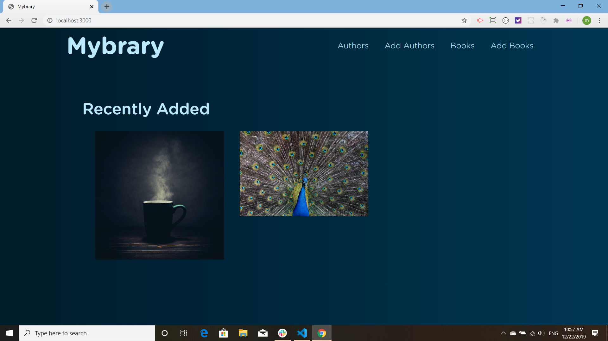

This app is [deployed on Heroku](https://marco-mybrary.herokuapp.com/). Thank you Web Dev Simplified!